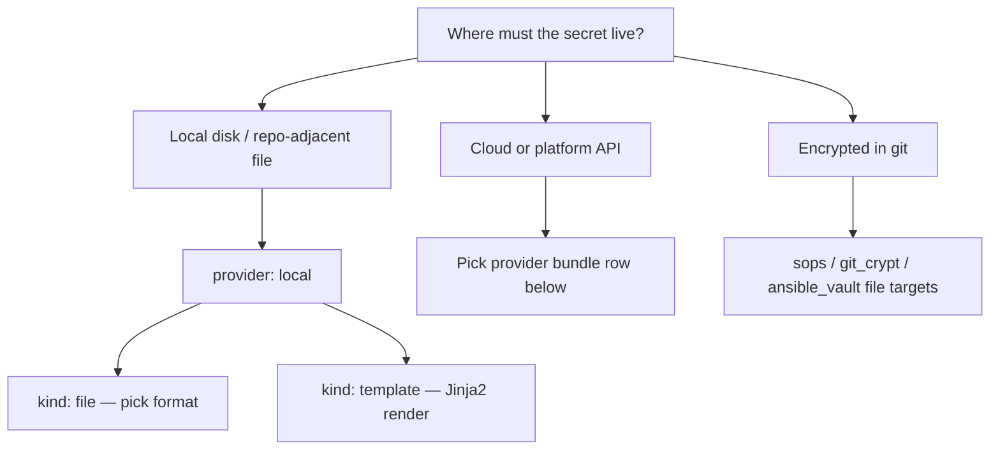

# SecretZero Author Skill

Use this skill whenever the task is to create or improve `Secretfile.yml` and related `.szvar` files.

**Absolute rule (non-negotiable):** see `skills/secretzero/SKILL.md` — **never consume secrets in agent context**; route all secret operations through SecretZero (detect/discover, validate, sync, web UI, agent sync). Do not ask users to paste values into chat.

For **new manifests**, **updates to existing manifests**, or **Hermes / MCP-driven authoring**, follow **Guided authoring session** below.

## Mission

Produce high-quality, json-schema compliant SecretZero manifests that:

- Pass `secretzero validate` with zero issues.
- Keep discovery and inventory **contextless** (metadata only; SecretZero commands, not file reads).
- Intelligently break out environment variance into `.szvar` files.
- Bind provider-backed targets to least-privilege identity policies for AWS/Azure/other authenticated environments.

## Capability discovery (generators & targets)

Use the **live catalog** before inventing `secrets[].kind` or `targets[].kind` values.

**Primary (machine-complete — preferred for agents):**

```bash
secretzero catalog --format json
secretzero catalog --provider gitlab --format json
secretzero catalog --bundle core --format json
secretzero catalog --kind gitlab_variable --kind-type target --verbose
```

The catalog is backed by `BundleRegistry` and includes every registered generator, target, and provider bundle with `typical_generators` hints per target.

**Human-readable summary:**

```bash
secretzero catalog
secretzero secret-types
```

**Manifest-scoped (already configured in this Secretfile — not the global catalog):**

```bash
secretzero list providers -f <manifest_root>/Secretfile.yml --format json
secretzero list targets -f <manifest_root>/Secretfile.yml --format json
```

**Provider introspection:**

```bash
secretzero providers list
secretzero providers capabilities <provider_kind>
```

The static **decision map** below is a curated shortcut; when it disagrees with `secretzero catalog --format json`, trust the catalog.

## Safety Rules (Non-Negotiable)

Inherits the **SecretZero only — never secrets in context** rule from `skills/secretzero/SKILL.md`.

- Never ask for, copy, log, or output plaintext secret values in chat, prompts, or tool results.
- Never use IDE/filesystem/MCP tools to read files that may contain secrets; use `detect` / `discover` / `list` / `status` instead.
- Discovery and inventory use metadata only (`status`, `test`, provider identity, `list secrets` JSON) — not `get --reveal` or manifest `render`.
- Human entry for missing values: `secretzero web` or `secretzero agent sync --web` — not chat paste.
- If provider identity evidence is missing, mark policy confidence as low and require human confirmation.

## Guided authoring session

Use this flow for **new** or **existing** manifests. Phases 0–1 apply to both; Phase 2 onward supports agent-assisted **add/edit loops** after discovery or whenever the user wants to extend `secrets[]`.

Do not skip steps unless the user explicitly says they already decided (then record their choice and continue).

### Phase 0 — Confirm manifest root (required, always first)

Before naming secrets or picking generators, **confirm the manifest root** with the user:

| Concept | Meaning |
|---------|---------|
| **Manifest root** | Directory that will contain `Secretfile.yml` (and usually `.gitsecrets.lock`) |
| **CLI path** | `secretzero -f <manifest_root>/Secretfile.yml …` for all later commands |

**Ask explicitly:**

1. Absolute path to the manifest root (default: current project/repo root if obvious).
2. Whether `Secretfile.yml` already exists there (edit vs create).
3. Default **local target base** for `provider: local` / `kind: file` paths — almost always the manifest root (`.`). If secrets should land under a subfolder (e.g. `config/`, `secrets/`), confirm that **once** and use it consistently in `config.path` (paths are relative to the manifest root unless absolute).

**Rules:**

- Do not draft `config.path` values until manifest root and local base folder are confirmed.
- Repeat the chosen root in one line before presenting secret-type options (e.g. “Manifest root: `/path/to/app`, local files under `.`”).
- If the user points at a monorepo subproject, use **that** directory as manifest root, not the repo apex, unless they want a shared top-level manifest.

### Phase 1 — Offer local discovery (optional)

Offer discovery when it helps; skip when the project is greenfield with no env files yet.

**Offer this prompt:**

> I can scan the manifest root for existing secret *names* (no values) and suggest manifest entries. Use local discovery? (yes / no)

| User choice | When it makes sense | Command (agent-safe; no values in output) |
|-------------|---------------------|-------------------------------------------|
| **Light scan** | `.env`, `.env.*`, `secrets*`, `credentials*` files may exist | `secretzero detect <manifest_root> --all-keys --format json` |
| **Deep scan** | Many config files; want ranked candidates + `Secretfile.detect.yml` draft | `secretzero discover <manifest_root> --local-only --dry-run --format json` (add `--no-llm` if LLM must stay off) |
| **Skip** | Greenfield or user already has a secret list | Continue to Phase 2 (inventory) or Phase 3 (add loop) |

**After discovery:**

- Present results as a **table of names** (and source file paths only) — never paste values from disk into chat.
- Ask which candidates to include in `secrets[]` (multi-select or “all above threshold”).
- Merge chosen rows into the manifest using **placeholders** (`null` leaves, `${VAR}`) — not literals. Co-load `skills/secretzero-handle/SKILL.md` when `.env` preseed is next.
- If `Secretfile.detect.yml` was written, treat it as a **draft**; human reviews before rename/replace to `Secretfile.yml`.

**Never** `read_file` on `.env`, `.env.*`, `*.pem`, or lane `.szvar` files in agent sessions.

### Phase 2 — Show current manifest inventory (existing or after first draft)

Whenever `Secretfile.yml` exists (or you just merged discovery drafts), **show what is already defined** before adding more entries. This phase applies to **updates** as well as greenfield manifests that already have rows.

**Load metadata (no values):**

```bash
secretzero list secrets -f <manifest_root>/Secretfile.yml --format json
secretzero status -f <manifest_root>/Secretfile.yml --format json   # optional: synced / not_synced
```

**Present visually in chat** — use a clear markdown table (and optional compact mermaid summary when ≤8 secrets):

| Secret | Generator | Targets | Lockfile status |
|--------|-----------|---------|-----------------|
| `db_password` | `random_password` | `local/file`, `aws/ssm_parameter` | synced |
| `api_key` | `static` | `local/file` | not_synced |

Rules:

- Include **name**, **kind**, **targets** (`provider/kind`), and **status** when `status --format json` was run.
- Do **not** include secret values, static defaults, or full target `config` blobs in chat (use `SZ_AGENT_MODE` when editing existing manifests under an agent).
- If the manifest is empty, say so explicitly and skip straight to Phase 3.

**Offer:**

> Here is your current Secretfile inventory. Add another secret, edit an existing one, or continue to validate? (add / edit / done)

### Phase 3 — Add / edit loop (repeat until user says done)

This loop is the main **agent-assisted authoring** path for both new and existing manifests. Run it after Phase 1 merges discovery candidates, or anytime the user wants to extend the manifest without rescanning disk.

**Loop prompt (each iteration):**

> Add a new secret, modify an existing entry, or finish manifest edits? (add / edit name / done)

When the user chooses **add** or **edit**:

1. **Destination category** (numbered menu):

   | # | Category | Typical `providers` / targets |
   |---|----------|-------------------------------|
   | 1 | **Local disk** | `provider: local` → `file` or `template` |
   | 2 | **Cloud / platform API** | `aws`, `azure`, `vault`, `github`, … |
   | 3 | **Encrypted in git** | `sops` / `git_crypt` / `ansible_vault` file targets |

2. **Refresh live capability lists** (once per iteration or when the user changes destination):

   ```bash
   secretzero catalog --format json
   secretzero catalog --provider <provider_kind> --format json
   secretzero catalog --kind <kind> --kind-type generator --verbose
   secretzero catalog --kind <kind> --kind-type target --verbose
   secretzero list providers -f <manifest_root>/Secretfile.yml --format json
   secretzero list targets -f <manifest_root>/Secretfile.yml --format json
   ```

3. **Generator menu** (`secrets[].kind`) — present as lettered options (run `secretzero catalog --format json` for the full list):

   | Option | `kind` | Use when |
   |--------|--------|----------|
   | A | `random_password` | High-entropy password |
   | B | `random_string` | API keys, tokens, alphanumeric secrets |
   | C | `static` | Human prompt, `${VAR}`, or structured dict leaves |
   | D | `script` | Generate via command (`ssh-keygen`, etc.) |
   | E | `azure_app_reg` | Entra app registration-shaped fields |
   | F | `github_pat` | Create GitHub App installation token via API |
   | G | `entra-agent-blueprint` | Agent Identity blueprint lifecycle |
   | H | `gitlab_project_token` | Create GitLab project access token via API |
   | I | `provider_backed` | Advanced; only if no bundle-specific kind fits |

4. **Target menu** — from `secretzero catalog --format json` (bundle `targets` + `typical_generators`) and the **Decision map**; for local, offer dotenv / json / yaml / toml / tfvars / template options.

5. **Per-entry checklist:** `name`, generator, target(s) (paths relative to manifest root), `.szvar` lane variance, `identity_policies` on cloud targets.

6. **Apply the edit** to `Secretfile.yml` (and `.szvar` if needed), then **re-run Phase 2** (refresh inventory table) before the next iteration.

Stop the loop when the user chooses **done** or confirms the inventory is complete.

### Phase 4 — Validate

1. `secretzero validate -f <manifest_root>/Secretfile.yml`
2. `secretzero sync --dry-run -f …` (and `--var-file` when lanes exist)
3. Fix schema/policy errors; re-show inventory if secrets were renamed or removed.

### Phase 5 — Optional operations UI and seeding handoff

After a clean validate (and dry-run when providers exist), offer **two separate checkpoints** (do not merge in one step):

**A — Network dashboard (optional, human-operated sync UI)**

> Start the SecretZero web dashboard in the background so you can sync, refresh, and edit static values in the browser? (yes / no)

If **yes** (trusted local machine only):

```bash
cd <manifest_root>
secretzero web -f Secretfile.yml --host 127.0.0.1 --port <free-port> \
  > /tmp/secretzero-web.log 2>&1 &
```

- Use **`127.0.0.1`** unless the user explicitly needs LAN access.
- Relay the **full login URL and bootstrap token** from command output or log — never paraphrase the token.
- Tell the user this is the **persistent dashboard** (`secretzero web`), not the one-shot Vector 2 form from `secretzero agent sync --web`.
- Remind them to use **Shut down** in the UI or stop the background job when finished.

**B — Agent seeding (when values are still missing)**

Load `skills/secretzero-agent/SKILL.md` for `secretzero agent sync --json` (and `--web` only for the **one-shot** localhost seeding form). Prefer the Phase 5A dashboard when the human wants a full UI; prefer agent sync when the agent should stay structured and metadata-only.

### Hermes + MCP

The guided phases are **transport-agnostic**; only the invocation changes.

| Phase | Hermes chat | SecretZero via MCP / CLI |
|-------|-------------|---------------------------|
| 0 Manifest root | Always ask in chat | — |
| 1 Discovery | Offer yes/no | Tools should wrap `detect` or `discover --local-only --dry-run --format json` |
| 2 Inventory | Format JSON as markdown table | `list secrets` / `status --format json` |
| 3 Add/edit loop | Menus + user choices | `secret-types`, `list providers`, `list targets`; write YAML via edit tool |
| 4 Validate | Report errors | `validate`, `sync --dry-run` (API: `POST /config/validate` where exposed) |
| 5 Web / seed | Offer dashboard; hand off sync skill | `web` subprocess or `agent sync` tool |

**MCP notes:**

- This repo ships **CLI + REST API**, not a first-party MCP server. Bridges expose subprocess tools; tool names may differ from CLI flags.
- **`detect` / `discover` are CLI-only** today — MCP authoring should call those commands, not Hermes filesystem reads of `.env`.
- **Do not use MCP `sampling/createMessage`** for discovery. Use SecretZero `detect` / `discover` (metadata-only JSON). Sampling sends file context to the host LLM and increases spill risk versus purpose-built scanners.
- Leave **sampling disabled** on untrusted SecretZero MCP bridges unless you operate a custom server with an explicit spill policy.
- With **`SZ_AGENT_MODE=true`**, co-load `skills/secretzero-handle/SKILL.md`; inventory and validate still work; avoid `render` and plaintext dumps.

### Definition of done (guided session)

- Manifest root and local path base were **confirmed with the user**.
- Current `secrets[]` were shown in a **readable inventory table** before and after edits.
- Add/edit loop ran until the user said **done**; kinds/targets chosen from **menus + CLI lists**, not invented.
- Discovery was offered when appropriate; if run, only metadata was shown in chat.
- `secretzero validate` passes; dry-run sync attempted when providers are configured.
- User was offered **`secretzero web`** (background, localhost) and/or **`secretzero-agent`** seeding, as separate optional steps.

---

## Install / Verify

Preferred:

```bash
uv tool install -U "secretzero[all]"
```

Targeted extras (install only what you author against):

| Bundle / area | Extra |
|---------------|--------|
| AWS | `secretzero[aws]` |
| Azure + Key Vault | `secretzero[azure]` |
| Entra Agent ID | `secretzero[entra_agent_id]` |
| Vault | `secretzero[vault]` |
| GitHub | `secretzero[github]` |
| GitLab | `secretzero[gitlab]` |
| Jenkins | `secretzero[jenkins]` |
| Kubernetes | `secretzero[kubernetes]` |
| Ansible Vault file | `secretzero[ansible_vault]` |
| Infisical (read) | `secretzero[infisical]` |
| Vercel | `secretzero[vercel]` |
| SOPS / git-crypt | core package (no extra) |

Verify:

```bash
secretzero --help
secretzero validate --help
secretzero catalog --format json
secretzero providers list
```

**Live bundle matrix (targets only):** `docs/reference/provider-bundles-auto.md` — supplement with `secretzero catalog --format json` for generators.

---

## Decision map: where should this secret go?

Start with the **destination**, then pick **provider → target kind → generator kind**.



### Local provider (`provider: local`)

No `providers:` entry required. Use for dev, CI artifacts, Terraform var files, and blueprint metadata sidecars.

| You need | `kind` | `config` highlights |
|----------|--------|---------------------|
| `.env` / `TF_VAR_*` workflows | `file` | `format: dotenv`, `path: .env`, `merge: true` |
| JSON/YAML/TOML config on disk | `file` | `format: json` \| `yaml` \| `toml` |
| **Terraform HCL** `terraform.tfvars` | `file` | `format: tfvars`, `path: …/*.tfvars`, `merge: true`, optional `key:` for TF variable name |
| Terraform **JSON** var file | `file` | `format: json`, `path: …/*.tfvars.json` |
| Rendered multi-secret file | `template` | `template_path`, `output_path` |

**tfvars v1 limits:** flat `name = "string"` only; gitignore `*.tfvars`; use `key` when manifest secret name ≠ Terraform variable name. See `examples/terraform-tfvars/`.

### Provider bundles (sync targets)

| Destination | `providers:` kind | `kind` (target) | Typical `secrets[].kind` (generator) | Notes |
|-------------|-------------------|-----------------|--------------------------------------|-------|
| AWS SSM Parameter | `aws` | `ssm_parameter` | `random_password`, `random_string`, `static` | Optional `config.format: json` for structured payloads |
| AWS Secrets Manager | `aws` | `secrets_manager` | same | same |
| Azure Key Vault | `azure` | `azure_keyvault` or `key_vault` | same + `azure_app_reg` for app-reg-shaped static | Bind `provider_identity` on tenant/subscription |
| HashiCorp Vault KV | `vault` | `vault_kv` or `kv` | same | Token/ambient auth |
| GitHub Actions / repo secret | `github` | `github_secret` | `random_*`, `static`, **`github_pat`** | PAT uses dedicated generator |
| GitLab CI variable (project) | `gitlab` | `gitlab_variable` | `random_*`, `static`, **`gitlab_project_token`** | `project: auto` supported |
| GitLab CI variable (group) | `gitlab` | `gitlab_group_variable` | `random_*`, `static` | Shared across group projects |
| Jenkins credential | `jenkins` | `jenkins_credential` | `random_*`, `static` | |
| Kubernetes Secret | `kubernetes` | `kubernetes_secret` | `random_*`, `static` | |
| K8s ExternalSecret (ESO) | `kubernetes` | `external_secret` | `random_*`, `static` | ESO-shaped sync |
| Vercel env var | `vercel` | `vercel_env` | `random_*`, `static` | `development` / `preview` / `production` |
| SOPS-encrypted file in repo | `sops` | `sops_file` | `random_*`, `static` | Unlock via SOPS; not plaintext in git |
| git-crypt filtered file | `git_crypt` | `git_crypt_file` | `random_*`, `static` | Requires git-crypt setup |
| Ansible Vault file | `ansible_vault` | `ansible_vault_file` | `random_*`, `static` | `secretzero[ansible_vault]` |
| **Entra Agent ID blueprint** | `entra-agent-id` | *(none — provider-only)* | **`entra-agent-blueprint`** | Graph lifecycle; often **also** `local`/`file`/`json` for metadata export |
| Infisical | `infisical` | *(none today)* | use **`source`** `provider_read` or import flows | Read/reference; not a write target |
| Keeper Password Manager | `keeper` | `keeper_record` | `random_*`, `static` | Read via `provider_read`; write/create/update vault records; rotate via sync |

### Core generators (any provider)

| `kind` | Use when |
|--------|----------|
| `random_password` | High-entropy password (length, charset in `config`) |
| `random_string` | API keys, tokens, alphanumeric secrets |
| `static` | Known value, human prompt, or `${VAR}` placeholder; dict leaves for multi-field |
| `script` | Generate via command (`zsh`, `ssh-keygen`, etc.) |
| `provider_backed` | Value created by provider API (advanced; prefer bundle-specific kinds when available) |

### Bundle-specific generators

| `kind` | Provider | Use when |
|--------|----------|----------|
| `azure_app_reg` | `azure` | Entra app registration fields (static-like prompting) |
| `github_pat` | `github` | Create GitHub App installation token via API |
| `gitlab_project_token` | `gitlab` | Create GitLab project access token via API (bootstrap PAT required) |
| `entra-agent-blueprint` | `entra-agent-id` | Microsoft Agent Identity blueprint + creds + optional child agents |

**Static-like kinds** (`static`, `azure_app_reg`, …): agent sync may prompt per null leaf; prefer `.szvar` to pre-fill lane values.

### Multi-target pattern

Same secret, multiple destinations (common):

```yaml
targets:
  - provider: aws
    kind: ssm_parameter
    config: { name: /${env}/db/password }
  - provider: local
    kind: file
    config: { path: .env, format: dotenv, merge: true, key: DB_PASSWORD }
```

Attach `identity_policies` on cloud targets when sync must be lane-bound (see below).

---

## Authoring Workflow

For **interactive**, **Hermes**, or **MCP** work, use **Guided authoring session** (inventory + add/edit loop). For quick expert edits without a walkthrough, use this checklist:

1. **Load schema context**
   - Treat `Secretfile.schema.json` and `src/secretzero/models.py` as source of truth.
2. **Confirm manifest root** (if paths or `-f` may change)
   - Same rules as Phase 0 in guided session.
3. **Use the decision map**
   - Pick destination → provider/target → generator before writing YAML.
4. **Model whole secrets first**
   - One logical secret per `secrets[]` entry unless a true multi-field bundle is needed.
5. **Select generator intentionally**
   - Prefer `random_password`, `random_string`, `static` (or static-like kinds) before `script` / `provider_backed`.
6. **Map explicit targets**
   - Every secret has clear targets unless intentionally deferred (e.g. Entra blueprint metadata-only phase).
7. **Break out environment variance**
   - Keep structural defaults in `Secretfile.yml`.
   - Move lane-specific values to `*.szvar` files (`dev.szvar`, `staging.szvar`, `prod.szvar`).
8. **Apply identity guardrails**
   - Add `kind: provider_identity` policies and attach with `identity_policies` where needed.
9. **Validate in loop**
   - `secretzero validate`
   - `secretzero render` (if interpolation/templating is used)
   - `secretzero sync --dry-run --var-file <lane>.szvar`

## Environment Breakout Heuristics (`.szvar`)

Prefer `.szvar` breakout when values differ by deployment lane:

- Target names/paths (`/${env}/...`)
- Regions, accounts, tenants, namespaces
- Role/session specific selectors
- Non-structural per-lane toggles
- Pre-filled `static` / `azure_app_reg` leaves (avoid re-prompts)

Keep in manifest:

- Secret definitions (`name`, `kind`, generator config shape)
- Provider aliases and auth mode intent
- Policy object structure

Pattern:

```yaml
variables:
  env: dev
  aws_region: us-east-1
```

`dev.szvar`:

```yaml
env: dev
aws_region: us-east-1
```

`prod.szvar`:

```yaml
env: prod
aws_region: us-west-2
```

## Contextless Secret Discovery (Safe Mode)

Use only discovery commands that return metadata (no secret values):

```bash
# Local repo scan (names / paths only)
secretzero detect <manifest_root> --all-keys --format json
secretzero discover <manifest_root> --local-only --dry-run --format json

# Provider / lockfile metadata (existing manifest)
secretzero status --format json
secretzero test --verbose --format json
secretzero catalog --format json
secretzero list providers -f Secretfile.yml --format json
secretzero list targets -f Secretfile.yml --format json
```

Derive policy candidates from actor/auth metadata (account, region, arn, tenant_id, subscription_id, namespace, etc.), never from secret contents.

**Guided session:** offer `detect` / `discover` in Phase 1; use this section for provider-identity policy drafting on an existing manifest.

## Target Policy Binding Guidance

- **AWS**: constrain `account` and `region` first; optionally constrain role/arn patterns.
- **Azure**: constrain `tenant_id` and, when available, `subscription_id`.
- **Other providers**: bind to strongest stable identity fields exposed by `get_actor_info()`.
- Avoid broad `*` or permissive regex unless explicitly approved.

Example:

```yaml
policies:
  aws_prod_identity:
    kind: provider_identity
    providers: [aws]
    match: all
    rules:
      - field: account
        glob: "111111111111"
      - field: region
        glob: us-east-1
```

## Related skills & examples

| Topic | Location |
|-------|----------|
| Agent sync / vectors | `skills/secretzero-agent/SKILL.md` |
| `.env`, ingest, `SZ_AGENT_MODE` | `skills/secretzero-handle/SKILL.md` |
| tfvars file target | `examples/terraform-tfvars/`, `.mex/patterns/file-target-tfvars.md` |
| Multi-env + AWS policies | `examples/multi-env-aws-policies/` |
| GitLab project token + variable | `examples/gitlab-project-token.yml` |
| Entra Agent ID | `examples/entra-agent-id-blueprint.yml`, `docs/ENTRA-AGENT-ID.md` |

## Definition of Done

- Manifest root (and local path base) were confirmed for new manifests.
- `Secretfile.yml` is schema compliant and readable.
- Provider/target/generator choices match the decision map (or document intentional exceptions).
- `secretzero validate` exits cleanly.
- `.szvar` files cover lane variance without duplicating manifest structure.
- Provider-backed targets are bound to least-privilege identity policies where supported.
- No plaintext secret material appears in prompts, logs, files, or responses.
